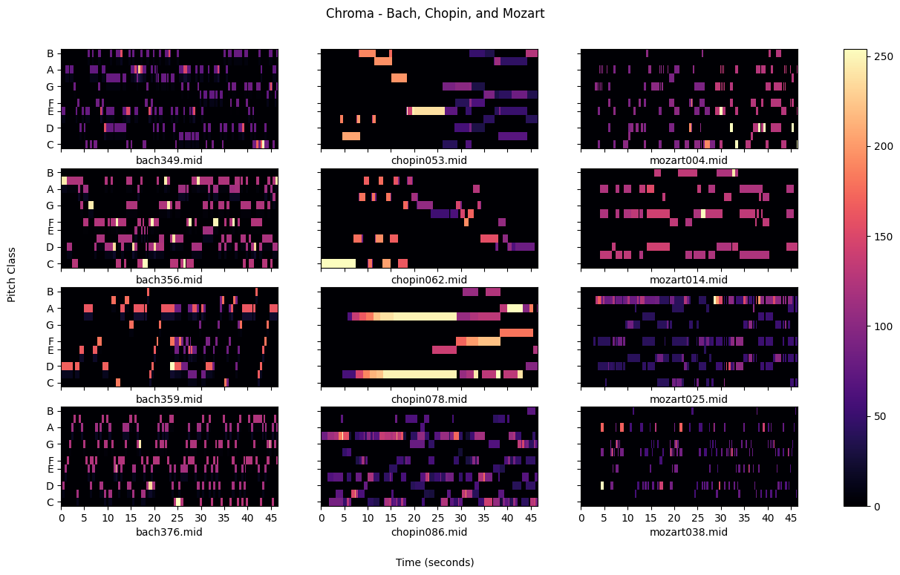
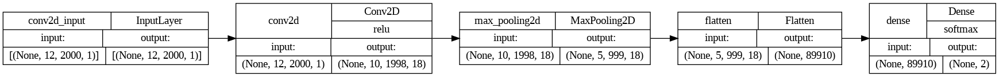
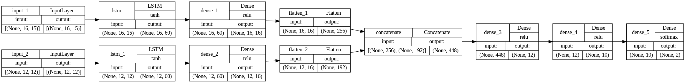

# Classical Composer Prediction using Deep Learning

This project is a part of the AAI-511 Neural Networks and Deep Learning course in the Applied Artificial Intelligence 
Program at the University of San Diego (USD).

### <b>Project Status: Completed 8/14/2023</b>

## Installation

To create a copy of the repository on your local device, use the following commands:

`git init`

`git clone https://github.com/jeraimondi/aai-nn-classification-composer.git`

## Project Intro

Deep learning approaches are used for the task of classifying the Classical composer of a given piece. Musical scores 
of Classical composers are converted into a standard Musical Instrument Digital Interface (MIDI) digital file format in 
order to programmatically extract different features which may be useful for this task. 

## Project Objectives

* Develop deep learning models to predict whether or not a particular piece belongs to each composer
* Experiment with multiple model architectures and techniques as a valuable learning experience:
  * Convolutional Neural Network (CNN)
    * Convolutions over chromagrams, or pitch class profiles (PCPs)
      * Represents relative energy in the 12 notes of the chromatic scale
  * Long Short-Term Memory (LSTM) using multiple features as inputs
    * Beats
      * Vector of beat locations in the sample
    * Pitch Class
      * Using a pitch class transition matrix

## Contributors

* [Jason Raimondi](https://github.com/jeraimondi)
* Kwabena Mensah
* Aria Alaghemand

## Methods Used

* Machine Learning
* Deep Learning

## Technologies

* Python

## Project Description

In this project, we build deep learning models using two different model architectures, CNN and LSTM, in order to 
experiment and compare the results of the resulting models on a per-composer basis.

As CNNs are more suitable for capturing spatial information from inputs, we extract the chroma feature from MIDI files 
as a series of 12 chroma vectors, representing the 12 pitch classes. The length of each chroma vector is dependent upon 
the duration of the piece. Considering this, we most commonly limit the durations to a common length in order to work 
with common feature and input sizes (e.g., 12x2000). We are able to visualize and compare the chroma features in an 
image form for a few sample composers using the librosa package, such as for the following example.

<H3>Chroma Feature Example</H3>

The CNN model architecture can be seen in the following plot.

<H3>CNN Model Architecture</H3>

The LSTM architecture is designed for and works well with sequential data. For this architecture, we incorporate 
multiple input features of beats and pitch class, each in parallel passing through their own input, LSTM, dense, and 
flattening layers in Keras sequential models before being concatenated and passed through additional dense layers. The 
LSTM model architecture can be seen in the following plot.

<H3>LSTM Model Architecture (Multiple Inputs)</H3>

Our key findings indicate that there was no single model architecture that performed well in predictions for all 
composers in question. There are many reasons which could help explain this, such as each composer having their own 
unique style of playing. The features used may not be adequate for predictions across a wide range of composers. 
Additionally, future work may be needed to optimize the dataset. For instance, some pieces in the dataset were very 
short in duration in comparison to the others, which is a challenge when using features over a time spectrum.

### Data Source

Composer dataset provided by [ole.sandiego.edu](https://ole.sandiego.edu/bbcswebdav/pid-3097352-dt-content-rid-46201906_1/xid-46201906_1)

Pieces in the dataset belonging to the following composers:
* Bach
* Bartok
* Byrd
* Chopin
* Handel
* Hummel
* Mendelssohn
* Mozart
* Schumann

## License

[MIT License](LICENSE)

## Acknowledgments
Thank you to all the USD professors for your continued dedication, guidance, and support throughout this course.

## References

McFee, B., Raffel, C., Liang, D., Ellis, D. P. W., McVicar, M., Battenberg, E., & Nieto, O. (2015). librosa: Audio and 
&nbsp;&nbsp;&nbsp;&nbsp;&nbsp;&nbsp;&nbsp;&nbsp;&nbsp;music signal analysis in python. Proceedings of the 14th python 
in science conference, 18-25.

Raffel, C., & Ellis, D. P. W. (2014). Intuitive Analysis, Creation and Manipulation of MIDI Data with pretty_midi. 15th 
&nbsp;&nbsp;&nbsp;&nbsp;&nbsp;&nbsp;&nbsp;&nbsp;&nbsp;International Society for Music Information Retrieval Conference.
